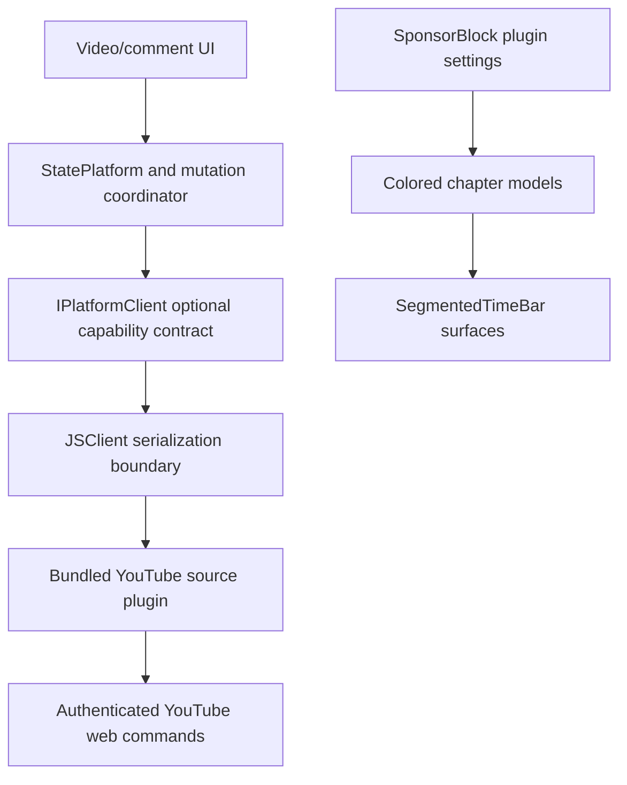

# Developer handoff: Grayjay Extended native platform comments

Status captured: **2026-08-07 (America/Los_Angeles)**

This document is the starting point for the next developer. It identifies the
repositories and revisions that belong together, describes the Android desktop
comments experiment, and records how to verify the work and the main risks
that remain.

## 1. Executive briefing

This is an **unofficial Grayjay Android reference implementation** that extends
Grayjay's source-plugin contract so a platform plugin can support native
comment mutations and native video reactions. The bundled YouTube plugin is the
first implementation of that generic contract.

The latest branch also adds configurable SponsorBlock timeline colors and
renders those segments on the portrait, fullscreen, minimized, and cast-control
timelines.

Research selected a new direction: keep YouTube's full desktop
comments component attached to the official watch-page runtime and isolate it
visually inside Grayjay. That experiment is wired into the active Android
branch for regular videos and the Shorts comments sheet. It is guarded by
Developer settings > Experimental > Official YouTube web comments and falls
back to the committed native comments UI when disabled or unavailable.

The current testable checkpoint is:

| Item | Current value |
| --- | --- |
| Active app repository | `github59173/grayjay-native-platform-comments` |
| Branch to use | `codex/native-platform-comments` |
| App commit | Use the newest prerelease's attached `build-info.txt` |
| Embedded YouTube plugin commit | `0c75d1ca678894cd0944d1cbff42c8cbb800b0c0` |
| App upstream baseline | `futo-org/grayjay-android` commit `993a9bd850f022f952460b1dfc0744b98e0c23b4` |
| YouTube plugin upstream baseline | `futo-org/grayjay-plugin-youtube` commit `36ae88e34905545d5eaa8c8152fd09a48461d756` |
| Latest prerelease | See the app repository's Releases page; tags use `native-comments-dev-<run>` |
| APK application ID | `com.futo.platformplayer.d` (`Grayjay Unstable`) |
| Last verified CI run | See the `Native platform comments` workflow for the newest release tag |

On 2026-08-07 the official-comments Android experiment compiled, passed its
focused policy tests, was installed on the `emulator-5554` Android Studio
emulator, loaded and expanded live Rickroll comment replies through YouTube's
own runtime, and routed a comment-author tap into Grayjay's native channel UI.

Important: the remote default branch `origin/main` is currently six commits
behind the testable branch. A fresh clone must explicitly check out
`codex/native-platform-comments` to reproduce the latest APK.

Useful links:

- App repository: <https://github.com/github59173/grayjay-native-platform-comments>
- Companion plugin repository: <https://github.com/github59173/grayjay-plugin-youtube-native-comments>
- Prereleases: <https://github.com/github59173/grayjay-native-platform-comments/releases>
- CI runs: <https://github.com/github59173/grayjay-native-platform-comments/actions/workflows/native-platform-comments.yml>

## 2. Released baseline and official-comments experiment

The released prerelease uses Grayjay's native comment UI and invokes platform
operations through optional source-plugin methods. The newer local experiment
replaces only the YouTube Platform comment destination with a constrained
Android WebView that loads the canonical desktop watch page and retains
YouTube's live `ytd-comments#comments` component in place.

The earlier parser, inferred reply tree, copied markup, and custom YouTube-style
renderer remain removed. The current design does not parse, detach, serialize,
or reconstruct comment HTML. YouTube's own custom elements, continuation
requests, menus, dialogs, composer, and mutation handlers stay inside the
official page runtime. The research lab remains as the selector/UI decision
record; the production document-start isolation script is a separate Android
asset.

The trees still contain none of the abandoned parser/plugin interfaces such as:

- `getCommentsWindow`
- `useYouTubeWebComments` or `useNativeYouTubeComments`
- `getCommentsSorted` or `getCommentsPresentation`
- `PlatformCommentSort` or `PlatformCommentsPresentation`
- `youtube_comment_parser.js`

The new host-owned experiment intentionally does contain versioned
`ytd-comments#comments` isolation code. It removes the watch-page player and
unrelated branches, hides the comment count and sort/filter controls, blocks
Googlevideo media responses, pauses page media, and keeps menus/dialogs. It
injects no plugin-provided JavaScript and exposes no JavaScript-to-native bridge.
The comments WebView hides its own scrollbar and hands each drag to Grayjay's
comments RecyclerView first, then consumes the remainder itself; reversing at
the comments top restores Grayjay metadata through the same gesture. Its canvas
and loading state resolve `R.color.black`/`R.color.white` and inject those app
theme resources into the isolation CSS instead of retaining YouTube's
`#0f0f0f` page background.

Channel anchors inside the official comments root are intercepted before
YouTube's SPA router can replace the isolated watch page. The document-start
script emits only a `grayjay-comments://channel` navigation containing the
clicked URL; the host validates and canonicalizes HTTPS YouTube handle,
`/channel/`, `/c/`, and `/user/` URLs before handing them to
`MainActivity.handleUrl`. Invalid or unsupported handoffs are consumed without
navigating the WebView or opening an external browser. This remains a
navigation seam, not a JavaScript-to-native object bridge.

Authentication is hydrated into Android's shared WebView cookie store from the
active bundled YouTube `JSClient` descriptor. Cookie names/domains are
validated; values are never logged. If Grayjay's clear-after-login setting is
enabled, only cookies hydrated by this surface are expired when the surface is
destroyed. Private mode never constructs the WebView.

## 3. Workspace and repository boundaries

The active app repository is the nested repository at:

```text
/Users/user1/Documents/Grayjay Extended/grayjay-native-platform-comments
```

The parent directory, `/Users/user1/Documents/Grayjay Extended`, is also an
older Git working tree containing proof-of-concept files and many uncommitted
changes. It is **not** the source of the current prerelease. Avoid running broad
Git commands from the parent directory.

There is also a sibling plugin checkout at:

```text
/Users/user1/Documents/Grayjay Extended/grayjay-plugin-youtube-native-comments
```

That sibling checkout is currently on commit `84b763f`, so it is older than the
plugin revision embedded in the app. For current plugin work, use either of the
app's YouTube submodule checkouts or fetch and switch the sibling repository to
the remote `codex/sponsorblock-timeline` branch at `0c75d1c`.

Both of these app paths are Git submodules and must always be pinned to the same
plugin revision:

```text
app/src/stable/assets/sources/youtube
app/src/unstable/assets/sources/youtube
```

## 4. What is implemented

### Native platform comments

- Create a top-level platform comment.
- Reply to a platform comment.
- Edit and delete comments owned by the active platform account.
- Like, dislike, and clear either reaction on comments.
- Reload action and ownership metadata from platform responses, including after
  reopening a video.
- Disable the composer for comments-disabled videos or genuinely locked reply
  threads.
- Keep Copy available in comment menus and expose Reply/Edit/Delete only when
  both source capabilities and per-comment metadata permit the action.
- Keep Platform and Polycentric destinations independent.
- Return structured mutation errors rather than leaking raw source failures
  into the UI.
- Disable comment mutations in Grayjay private mode.

The latest plugin fix avoids falsely marking a reply thread as locked merely
because a compact renderer does not include a replies preview. The plugin now
relies on actionable command/state metadata.

### Native video reactions

- Query the active source for the user's platform like/dislike state.
- Set or clear a platform video reaction.
- Render Polycentric and platform reaction rows independently in the same
  compact control.
- Use the source's official like count.
- Treat an optional Return YouTube Dislike value as a display estimate only.
- Render a real zero as `0`; unknown/unavailable estimates remain disabled.
- Apply a validated source accent color rather than hard-coding YouTube checks
  throughout the UI.

### SponsorBlock timeline colors

- Carries an optional ARGB `timelineColor` from plugin chapters through the JS
  bridge into app chapter models.
- Adds an inline color swatch to each SponsorBlock skip-mode setting.
- Provides a native color editor with hue, saturation/value, alpha, ARGB hex,
  preview, reset, cancel, and apply controls.
- Persists a separate color for Sponsor, Self Promotion, Intro, Outro, Preview,
  Off-topic, and Filler.
- Uses SponsorBlock's category colors as defaults.
- Shows segments only for categories configured as Manual or Automatic; `No
  skip` categories are omitted.
- Clips invalid ranges, merges adjacent same-color ranges, preserves short
  ranges, and uses SponsorBlock-compatible overlap ordering.
- Prevents the small portrait player from rendering duplicate/offset overlays.
- Leaves ordinary platform chapters intact and ignores timeline colors from
  plugins that do not provide them.

## 5. Architecture

The core design rule is that Kotlin owns generic contracts and UI, while the
source plugin owns every YouTube-specific endpoint, token, authenticated
request, and response parser.



Older plugins remain compatible because every new `IPlatformClient` method has
an unsupported/default implementation and the UI gates actions through
`PlatformClientCapabilities` plus item-level metadata.

Native mutations keep authentication inside Grayjay's existing plugin runtime
and HTTP client. The official-comments experiment additionally hydrates the
active plugin's validated YouTube/Google cookies into the process-wide Android
WebView cookie store so the official composer and actions use the same account.
It must never log those values, copy them to a new persistence layer, or expose
them through a JavaScript bridge.

## 6. Principal code map

| Area | Principal files |
| --- | --- |
| Public plugin declarations | `app/src/main/assets/devportal/plugin.d.ts`, `app/src/main/assets/scripts/source.js` |
| Generic capabilities | `IPlatformClient.kt`, `PlatformClientCapabilities.kt` |
| Comment models/coordinator | `PlatformCommentMutation.kt`, `PlatformCommentingState.kt`, `IPlatformComment.kt`, `CommentMutationCoordinator.kt` |
| Video reaction models | `PlatformVideoReaction.kt` |
| JS bridge | `JSClient.kt`, `JSComment.kt`, `JSCommentPager.kt`, `JSCommentMutationResult.kt`, `JSVideoReactionResult.kt` |
| App orchestration | `StatePlatform.kt` |
| Comment UI | `CommentsList.kt`, `CommentDialog.kt`, `CommentViewHolder.kt`, `RepliesOverlay.kt`, `CommentsModalBottomSheet.kt` |
| Official YouTube comments host | `YouTubeCommentsWebView.kt`, `YouTubeCommentsWebPolicy.kt`, `youtube_comments_surface.js` |
| Official comments integration/settings | `VideoDetailView.kt`, `CommentsModalBottomSheet.kt`, `SettingsDev.kt` |
| Video reaction UI | `VideoDetailView.kt`, `PillRatingLikesDislikes.kt`, `rating_likesdislikes.xml` |
| Timeline models/rendering | `TimelineColor.kt`, `TimelineSegment.kt`, `SegmentedTimeBar.kt` |
| SponsorBlock settings UI | `SourcePluginConfig.kt`, `DropdownField.kt`, `FieldForm.kt`, `InlineColorPicker.kt` |
| Player/cast integration | `FutoVideoPlayer.kt`, `FutoVideoPlayerBase.kt`, `CastView.kt`, player layouts |
| YouTube implementation | `comment_mutations.js`, `video_reactions.js`, `sponsorblock.js` in either YouTube submodule |
| Generated plugin bundle | `YoutubeScript.js` in each YouTube submodule |
| CI/release | `.github/workflows/native-platform-comments.yml` |
| Repository verifier | `scripts/verify-native-platform-comments.sh` |
| Desktop comments research | `research/youtube-desktop-comments-lab/` |

The optional plugin methods added by the feature are:

```text
source.createComment(contentUrl, message)
source.replyToComment(comment, message)
source.editComment(comment, message)
source.deleteComment(comment)
source.likeComment(comment, enabled)
source.dislikeComment(comment, enabled)
source.getCommentingIdentity()
source.getVideoReactionState(contentUrl)
source.setVideoReaction(contentUrl, reaction)
```

The associated capability flags are `hasCommentsCreate`,
`hasCommentsReply`, `hasCommentsEdit`, `hasCommentsDelete`,
`hasCommentsLike`, `hasCommentsDislike`, `hasGetCommentingIdentity`,
`hasVideoReactionState`, and `hasVideoReactionMutation`.

## 7. Clone and local setup

Prerequisites:

- Git and Git LFS
- JDK 21 for parity with CI
- Android SDK 36
- Node.js 20 or newer for plugin generation and tests
- An Android emulator/device for authenticated and instrumentation testing

Start from the latest branch, not the remote default branch:

```bash
git clone --recurse-submodules \
  https://github.com/github59173/grayjay-native-platform-comments.git
cd grayjay-native-platform-comments
git switch codex/native-platform-comments
git submodule update --init --recursive
git lfs pull
```

If Gradle cannot find the Android SDK, create an uncommitted
`local.properties` with the developer machine's SDK path:

```properties
sdk.dir=/absolute/path/to/Android/sdk
```

The FFmpeg AAR is stored with Git LFS. If it remains a small pointer file,
Android builds fail with a ZIP/manifest error. A materialized file is about 34
MiB and has LFS object ID
`22c06ca0d1a5808b2fc0a12227d5915b3126bc0b9b1305cf6bab855f2ec6fcbb`.

## 8. Build and verification

Run the standard repository verifier:

```bash
./scripts/verify-native-platform-comments.sh
```

It verifies that stable and unstable use the same YouTube plugin revision, runs
`npm run verify` in both submodules, and runs focused stable/unstable Android
unit tests for platform comment mutations and video reactions.

Build both debug variants with:

```bash
./gradlew :app:assembleStableDebug :app:assembleUnstableDebug
```

Additional Android SponsorBlock unit tests exist but are not currently selected
by `verify-native-platform-comments.sh`:

```bash
./gradlew :app:testStableDebugUnitTest \
  --tests com.futo.platformplayer.SponsorBlockTimelineTests
./gradlew :app:testUnstableDebugUnitTest \
  --tests com.futo.platformplayer.SponsorBlockTimelineTests
```

The layout checks in `SponsorBlockTimelineInstrumentedTests.kt` are Android
instrumentation tests. The current GitHub workflow compiles debug variants but
does not run these tests on an emulator. Run them before treating timeline UI
work as release-ready.

At the captured checkpoint:

- GitHub Actions run 11 passed plugin verification, focused Android unit tests,
  stable/unstable debug assembly, persistent signing, artifact upload, and
  prerelease publication.
- The local official-comments delta passed
  `:app:compileStableDebugKotlin`, `:app:compileUnstableDebugKotlin`,
  `:app:testUnstableDebugUnitTest --tests com.futo.platformplayer.views.comments.YouTubeCommentsWebPolicyTest`,
  `:app:assembleUnstableDebug`, and a Node syntax parse of
  `youtube_comments_surface.js` using Android Studio's bundled JDK.
- Emulator validation on the Rickroll watch URL showed the official composer,
  loaded the pinned thread, expanded the 961-reply continuation, and scrolled
  into later live comments. The comment count and sort/filter controls were
  absent, and Grayjay's native Platform composer was not duplicated.
- Tapping the pinned `@YouTube` comment author opened Grayjay's native YouTube
  channel screen through the enabled channel client. Reopening the minimized
  Rickroll video restored the same live comments surface instead of leaving it
  on YouTube's channel SPA or an empty isolated page.
- Both pinned plugin trees passed their generated-module checks and all 61 Node
  tests; the stable and unstable native comment/reaction unit suites plus the
  WebView policy tests also passed before prerelease publication.
- Completion of the full authenticated manual matrix is not recorded. The next
  developer should repeat it with a disposable/test YouTube account.

## 9. Manual test matrix

Use `docs/native-platform-comments/TESTING.md` as the authoritative checklist.
At minimum verify:

1. Create, reload, edit, and delete a top-level comment.
2. Reply from both the reply field and overflow menu; edit/delete an owned
   reply.
3. Reopen the video and confirm ownership actions are reconstructed.
4. Like, clear, dislike, clear, and switch comment reactions.
5. Toggle platform and Polycentric video reactions independently.
6. Confirm comments-disabled videos and truly locked threads disable the right
   composer without sending a request.
7. Confirm ordinary threads without a replies preview are not falsely locked.
8. Confirm real zero and unavailable dislike estimates render differently.
9. Exercise SponsorBlock colors, opacity, reset, persistence, all skip modes,
   portrait/fullscreen/minimized/cast timelines, rotation, and overlaps.
10. Recheck signed-out, signed-in, private-mode, activity recreation, and source
    reload behavior.

Delete all test comments afterward. Never attach cookies, authorization
headers, visitor data, action tokens, or authenticated response bodies to a
public issue.

## 10. Editing the companion plugin safely

`YoutubeScript.js` contains a generated section built from:

```text
comment_mutations.js
video_reactions.js
sponsorblock.js
```

After changing one of those modules:

```bash
npm run build
npm run verify
```

Commit and push the change in the companion plugin repository first. Then pin
the resulting commit in **both** app submodules and commit both gitlink changes
in the app repository. The app verifier intentionally fails when the two pins
differ.

Do not edit only the generated section in `YoutubeScript.js`; the generated-file
check will reject drift. Do not bump the official YouTube plugin identity or
claim an official FUTO version/signature. The fork currently retains upstream's
published version metadata intentionally.

## 11. CI and prerelease publication

Workflow: `.github/workflows/native-platform-comments.yml`

Triggers and effects:

| Trigger | Verification/build | Artifact | GitHub prerelease |
| --- | --- | --- | --- |
| Pull request | Yes | No | No |
| Push to `codex/**` | Yes | Yes, retained 30 days | No |
| Push to `main` | Yes | Yes | Yes |
| Manual `workflow_dispatch` | Yes | Yes | Yes |

CI assigns:

```text
versionName = 0.2.0-dev.<run number>+<7-character commit>
versionCode = 100000 + <run number>
```

The published APK is the universal `unstableDebug` build. It can coexist with
official stable Grayjay. The repository secret
`GRAYJAY_DEBUG_KEYSTORE_BASE64` must remain configured for later APKs to update
an existing development installation without deleting its app data. Never
write the keystore or its encoded value into this repository.

The workflow's release notes cover the official desktop-comments experiment,
SponsorBlock colors, and the retained native comments fallback. Update them
when the release focus changes.

A prior retry remained queued during a GitHub Actions incident and never
received job objects. Run 11 was a fresh manual dispatch after service recovery
and completed successfully. If a future retry has no jobs, start a fresh
dispatch rather than assuming the old queued event will recover.

## 12. Current worktree cautions

Before this handoff document was created, the app worktree already showed:

```text
M app/aar/ffmpeg-kit.aar
? app/src/stable/assets/sources/youtube
```

The first entry is the materialized Git LFS FFmpeg artifact. The second is
caused by an untracked `.DS_Store` inside the stable YouTube submodule. Neither
is part of the current feature delta. Do not stage them with a blanket
`git add -A`.

The official-comments experiment's principal files are
`YouTubeCommentsWebView.kt`, `YouTubeCommentsWebPolicy.kt`,
`youtube_comments_surface.js`, and `YouTubeCommentsWebPolicyTest.kt`; it also
edits `SettingsDev.kt`, `VideoDetailView.kt`, `CommentsModalBottomSheet.kt`,
`CommentsList.kt`, and `strings.xml`.

Use scoped staging and inspect submodules directly:

```bash
git status --short --branch
git -C app/src/stable/assets/sources/youtube status --short --branch
git -C app/src/unstable/assets/sources/youtube status --short --branch
```

## 13. Known risks and unfinished work

1. **Upstream drift:** the app and plugin are based on fixed 2026-era upstream
   commits. Rebasing onto current FUTO repositories will likely produce UI,
   model, Gradle, and generated-plugin conflicts.
2. **Volatile YouTube commands:** mutation endpoints and renderer command shapes
   are private web behavior, not a stable public API. Fail closed when command
   metadata is absent; do not guess tokens.
3. **Manual authentication coverage:** CI fixtures cannot prove that live
   signed-in mutations still work. Repeat the authenticated matrix after any
   YouTube response change.
4. **SponsorBlock Android test gap:** its unit and instrumentation suites are
   not fully wired into the standard verifier/workflow.
5. **Branch divergence:** the released state is six commits ahead of
   `origin/main`; default-branch users will miss the latest UI, SponsorBlock,
   and reply-lock fixes.
6. **Plugin checkout divergence:** the sibling plugin clone is stale; the app
   submodule pin is the current source of truth.
7. **Unofficial signing/distribution:** the prerelease is a debug development
   build, not an official FUTO release. Production distribution requires an
   approved release process and keystore.
8. **No upstream proposal:** no FUTO issue or pull request has been opened. Core
   contribution would require rebasing, maintainer agreement, appropriate test
   evidence, and the CLA described in `CONTRIBUTION.md`.
9. **Volatile DOM seam:** the official-comments experiment depends on
   `ytd-comments#comments` and a small set of YouTube renderer selectors. The
   component stays attached to its runtime, but a YouTube layout rename can
   still trigger the 15-second native fallback.
10. **WebView maintenance surface:** rerun signed-in, signed-out, consent,
    comments-disabled, offline, Shorts, rotation, renderer-crash, and private
    mode tests after Android System WebView or YouTube changes. Only the
    Rickroll regular-video path was exercised in the captured emulator pass.
11. **Experiment toggle location:** the switch currently lives under Grayjay's
    Developer Settings rather than the YouTube source settings. Moving it into
    plugin configuration requires changing and republishing both bundled
    YouTube plugin variants as well as the host lookup.

## 14. Recommended first actions for the next developer

1. Review the local official-comments diff and keep the current extraction
   boundary: the full YouTube page runtime with `ytd-comments#comments` attached.
   Do not revive the removed parser/copied-markup implementation.
2. Complete the missing manual matrix: Shorts, signed-out/source-login reload,
   comments-disabled, consent/CAPTCHA, offline, rotation/back, renderer crash,
   and private mode with zero YouTube WebView requests.
3. Add host tests around exactly-once fallback, navigation policy, cookie
   cleanup, media blocking, and document-start isolation fixtures before
   publishing the experiment.
4. Clone the active app repository recursively and switch to
   `codex/native-platform-comments`.
5. Confirm both YouTube submodules resolve to `0c75d1c` and install Node 20+,
   JDK 21, Android SDK 36, and Git LFS.
6. Run the repository verifier, both SponsorBlock unit-test variants, and both
   debug assemblies.
7. Decide whether to commit/publish the local experiment, then use the
   repository's persistent CI signing key for an APK that upgrades prerelease
   11 without an Android signature reset.
8. Decide whether to merge the six feature-branch commits into `main` so the
   default branch matches the published state.
9. Wire SponsorBlock unit/instrumentation coverage into CI.
10. If upstreaming is desired, first rebase both repositories independently and
   preserve the app/plugin authentication boundary during conflict resolution.

## 15. Existing detailed documentation

- `NATIVE_PLATFORM_COMMENTS.md` — project overview and baseline
- `docs/native-platform-comments/ARCHITECTURE.md` — design boundaries and flows
- `docs/native-platform-comments/IMPLEMENTATION.md` — implementation layers and
  review slices
- `docs/native-platform-comments/TESTING.md` — automated and authenticated test
  matrix
- `docs/native-platform-comments/TESTING_APK.md` — installing and testing the CI
  APK
- `docs/native-platform-comments/SECURITY.md` — credential and token handling
- `docs/native-platform-comments/UPSTREAMING.md` — proposed FUTO contribution
  process
- `docs/native-platform-comments/PROVENANCE.md` — upstream sources and revisions
- `app/src/stable/assets/sources/youtube/MODIFICATIONS.md` — companion plugin
  change record
- `app/src/stable/assets/sources/youtube/docs/ARCHITECTURE.md` — plugin-specific
  architecture
- `app/src/stable/assets/sources/youtube/docs/TESTING.md` — plugin-specific tests
- `research/youtube-desktop-comments-lab/EXTRACTION_NOTES.md` — live desktop
  selector map, observed component counts, and fixture limitations

When documentation and code disagree, the pinned commits and executable tests
are the source of truth. Update this handoff whenever the active branch,
submodule pin, release, signing setup, or architectural direction changes.
